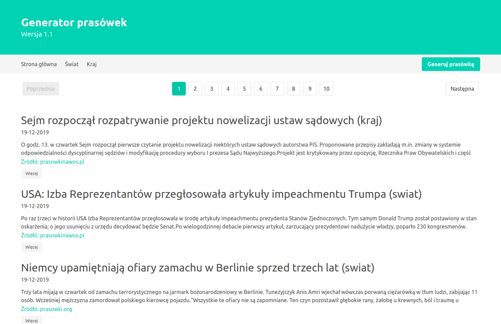

# Press Review Generator
> Simple and fast press review generator is now online. News are being drawn from different sources.

🇵🇱 [Polish README](README.pl.md)

:earth_americas: [Website link](https://generator-prasowek.herokuapp.com/)

:clock10: [Old desktop application](https://github.com/Karol-Waliszewski/Prasowa-Maker)

## Development :wrench:

+ Server was built on [Node.js](https://nodejs.org/) with a use of [express.js](https://expressjs.com/)

+ News database is [MongoDB](https://www.mongodb.com/), and the connection between database and server relies on [mongoosee.js](https://mongoosejs.com/)

+ For [web scraping](https://en.wikipedia.org/wiki/Data_scraping#Web_scraping) I used [axios](https://github.com/axios/axios) + [cheerio](https://github.com/cheeriojs/cheerio)

+ View are being rendered by [handlebars.js](https://handlebarsjs.com/)

+ Stylesheets base on [Bulma](https://bulma.io/) framework

## Sources :satellite:
+ [prasowki.org](https://prasowki.org/)
+ [prasowkinawos.pl](https://prasowkinawos.pl/)

## Meta

Karol Waliszewski – [karolwaliszewski@gmail.com](mailto:karolwaliszewski@gmail.com)

https://github.com/Karol-Waliszewski

